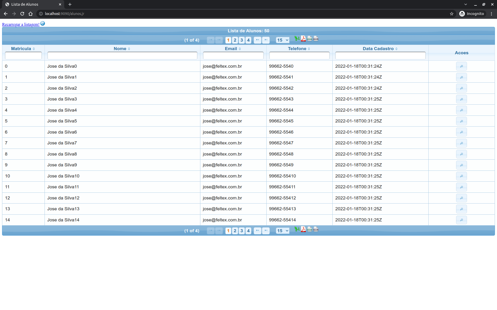

# academicnet

  Sistema de controle acadêmico simples. Nele criamos uma API Rest em Java que permite fazer o CRUD de alunos utilizando
  Spring Boot. Além disso, temos também uma tela de consulta de alunos onde podemos exportar os dados em Excel, PDF, CSV
  e XML.

  Este projeto é utilizado no canal [feltex](https://www.youtube.com/feltexbr) para exemplos práticos de Java.





## Vídeos desta série


## Spring Boot
- SPRING BOOT uma aplicação completa | Criando o projeto - https://youtu.be/WKL_BrUfe9Q
- SPRING BOOT uma aplicação completa | Validando a API - https://youtu.be/74-eFku7XQE
- SPRING BOOT uma aplicação completa | usando o Postman - https://youtu.be/tWGi_QKdGHo
- SPRING BOOT uma aplicação completa | Vamos usar o Mysql - https://youtu.be/qHpjK3wNjxs
- SPRING BOOT uma aplicação completa | Utilizando o primefaces - https://youtu.be/GHQX3H_hfyw
- SPRING BOOT uma aplicação completa | Testes automáticos - https://youtu.be/SBvKXe2pk8w
- SPRING BOOT uma aplicação completa | Como usar o docker - https://youtu.be/KynRfzk23Jc
- SPRING BOOT uma aplicação completa | Deploy na Amazon Web Services - https://youtu.be/qRBw_XKU8CE


## Pré-requisitos

1. [Java](https://youtu.be/_NCt_82M0MA)
1. [Maven](https://youtu.be/P29usdprI-E)
1. IDE [Intellij](https://youtu.be/Wsm3lbY8_bI) ou [Eclipse](https://youtu.be/veXmZJdyouQ)
1. [MySQL](https://youtu.be/vramc8g9h_s)
1. [Postman](https://youtu.be/tWGi_QKdGHo)


### Iniciando o banco de Dados

```
cd docker

docker-compose up

```


## Comandos do Maven

Instalando as dependências da aplicação

- `mvn clean install`

Executando os testes
- `mvn clean test`

## Iniciando a aplicação

Usando o maven

- `mvn spring-boot:run`

Usando Java

- `java -jar target/academicnet.war` 


## Criar a imagem Docker

```

docker build -t <usuario-docker-hub>/academicnet:V3 .

docker push <usuario-docker-hub>/academicnet:V3

```

## Vídeos de apoio do Canal 

- Java 11
   - Como instalar o Java 🍵 no Windows ⛳ - https://bit.ly/3saNbUN
   - Como instalar o Java🍵 no Linux 🐧 - https://bit.ly/3dgyUS6

- Eclipse   
   - Como instalar o Eclipse 🌑 no Windows ⛳ - https://bit.ly/3gcrqRZ  
   - Como instalar o Eclipse 🌑 no Linux 🐧 - https://bit.ly/2Qn906l
   
- IntelliJ
  - Como instalar no Windows -  https://www.youtube.com/watch?v=5F7aLMDlXUc&t=1s
  - Como instalar no Linux - https://www.youtube.com/watch?v=5F7aLMDlXUc&t=1s
  

- Maven
    https://maven.apache.org/download.cgi
    
- Banco de Dados MySQL
    - Como instalar o Docker - MySQL usando Docker -  Docker
    - Docker-Compose - https://www.youtube.com/watch?v=vramc8g9h_s&t=2s
